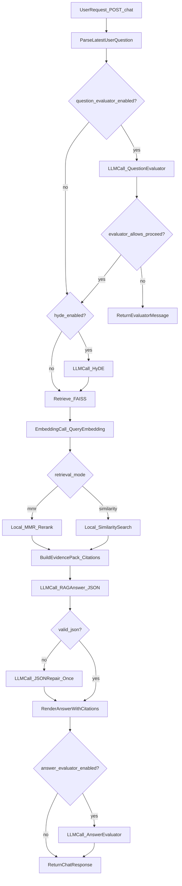

# RAG request flow and provider calls

This document explains what happens (and which external providers may be called) when a client sends `POST /chat`.

The key point: **RAG is not just “1 evaluator call + 1 answer call.”** Retrieval typically requires **embeddings**, and this project also supports optional **HyDE** and optional **evaluation** stages that can add more calls.

## Summary: which steps make external calls

- **Question evaluator** (optional): LLM call when `question_evaluator.enabled=true`.
- **HyDE** (optional): LLM call when `hyde.enabled=true`. Produces a retrieval-focused query; it does **not** answer the question.
- **Retrieval embeddings** (typical): embedding model call when searching FAISS (both `mmr` and `similarity` modes).
- **Answer generation**: LLM call to produce a structured, evidence-grounded answer.
- **Answer JSON repair** (optional): one extra LLM call if the first answer is not valid JSON.
- **Answer evaluator** (optional): LLM call when `answer_evaluator.enabled=true`.

## Pipeline diagram

## Step-by-step: what `/chat` does

### 1) Extract the latest user question

The API looks for the most recent message with `role="user"` and uses that as the question for the pipeline.

### 2) Optional: question evaluator stage (LLM call)

If enabled, the system sends the question to the **question evaluator** provider/model. The evaluator response is expected to be JSON describing a status such as “Pass/Suggest/Rejected”.

- If the evaluator rejects, the request returns early (no retrieval, no answer generation).
- If the evaluator suggests changes and `proceed=false`, the request can also return early.

Configuration keys (per tenant/agent):
- `question_evaluator.enabled`
- `question_evaluator.provider`
- `question_evaluator.model`
- `question_evaluator.system_prompt`
- `question_evaluator.temperature`
- `question_evaluator.max_tokens`

### 3) Optional: HyDE query generation (LLM call)

If enabled, HyDE generates a *hypothetical excerpt* that would appear in relevant documents. This output is used **only to improve retrieval**.

Important clarifications:
- **HyDE is not MMR.** HyDE is an LLM step that rewrites/expands the query.
- If HyDE fails, the pipeline falls back to the original question for retrieval.

Configuration keys:
- `hyde.enabled`
- `hyde.provider`
- `hyde.model`
- `hyde.temperature`
- `hyde.max_tokens`

### 4) Retrieval against FAISS (embedding call + local ranking)

Retrieval is performed from the tenant/agent FAISS store. The retrieval mode controls how results are selected:

- `retrieval.mode="similarity"`: standard similarity search
- `retrieval.mode="mmr"`: **Maximal Marginal Relevance** selection (diversifies results)

Important clarifications:
- **MMR does not call an LLM provider.** It is a local selection strategy performed by the retriever.
- **Embeddings are still required** to search the vector store in either mode. That means you should expect an **embedding provider call** at query time.

Configuration keys:
- `retrieval.mode` (`"mmr"` or `"similarity"`)
- `retrieval.k` (final number of chunks returned)
- `retrieval.fetch_k` (MMR candidate pool size)
- `retrieval.lambda_mult` (MMR diversity tradeoff)

Embedding provider/model selection:
- The embedding provider/model used for retrieval is stored in the vector store’s `meta.json` (under `vector_store/<tenant>/<agent>/meta.json`).
- Ingestion creates/updates the vector store using the chosen embedding provider/model and writes that metadata.

### 5) Evidence packing (no external call)

The retrieved chunks are normalized and assigned stable citation IDs (`C1`, `C2`, ...). These evidence items are used to force citations in the answer.

### 6) Answer generation (LLM call) + optional JSON repair (extra LLM call)

The main RAG model is prompted to output **strict JSON** (summary bullets + quotes), grounded only in the evidence items.

If the JSON is invalid or doesn’t match the schema, the pipeline performs **one** repair attempt using the same provider/model (an additional LLM call).

Configuration keys:
- `main_rag.enabled` (usually true)
- `main_rag.provider`
- `main_rag.model`
- `main_rag.temperature`
- `main_rag.max_tokens`

### 7) Optional: answer evaluator stage (LLM call)

If enabled, the generated answer is sent to the answer evaluator provider/model for scoring/flagging and logged for auditing.

Configuration keys:
- `answer_evaluator.enabled`
- `answer_evaluator.provider`
- `answer_evaluator.model`
- `answer_evaluator.system_prompt`
- `answer_evaluator.temperature`
- `answer_evaluator.max_tokens`

## Expected number of external calls

The count varies by configuration and whether JSON repair triggers:

- **2 calls**: (no evaluator, no HyDE) + (embeddings + answer)
- **3 calls**: evaluator + (embeddings + answer) *or* HyDE + (embeddings + answer)
- **4 calls**: evaluator + HyDE + embeddings + answer
- **5 calls**: evaluator + HyDE + embeddings + answer + JSON repair
- **6 calls**: evaluator + HyDE + embeddings + answer + JSON repair + answer evaluator

If you are trying to enforce “exactly N calls”, disable HyDE and answer evaluator, and ensure your answer model reliably emits valid JSON (or change the answer format to avoid repair).

